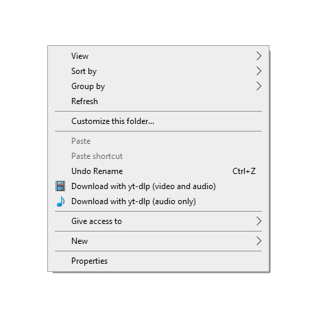

# yt-dlp-windows-context-menu
Adds buttons to the right click menu in Windows Explorer to download videos using yt-dlp. Works with YouTube and all the [services supported by yt-dlp](https://github.com/yt-dlp/yt-dlp/blob/master/supportedsites.md).

[**Download here**](https://github.com/sergidiazlopez/yt-dlp-windows-context-menu/archive/refs/heads/master.zip)

## Install yt-dlp
The easiest way to install yt-dlp is using winget. It comes with latest Windows 10 and Windows 11. Double-click the `install-yt-dlp.bat` file.

If this does not work check [other methods](https://github.com/yt-dlp/yt-dlp/wiki/Installation#Windows).

## Install context menu
Run `install.reg` to install.

## Uninstall
Run `uninstall.reg` to uninstall the context menu. This will not remove yt-dlp.
